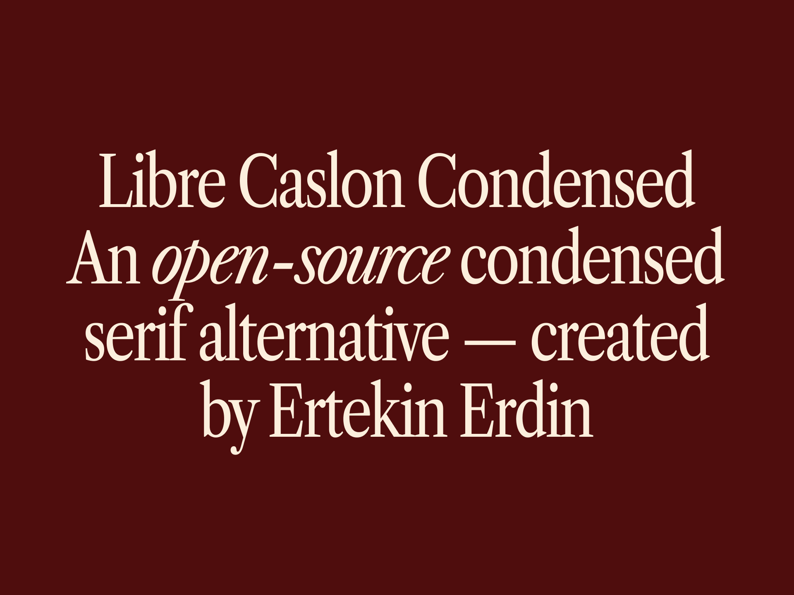

# Libre Caslon Condensed



Libre Caslon Condensed is an open-source condensed serif alternative designed to fill the gap in the market for high-quality condensed serif alternatives. This font, which is created by modifying the "Libre Caslon Text" font family, offers a harmonious blend of elegance and readability, making it an ideal choice for various design projects.


## Building the Fonts

The font is built using fontmake and gftools post processing script. Tools are all python based, so it must be previously installed.

To install all the Python tools into a virtualenv, do the following:

From terminal:

```
cd your/local/project/directory
```

once in the project folder create a virtual environment. 
This step has to be done just once, the first time:

```
python3 -m venv venv
```

activate the virtual environment

```
source venv/bin/activate
```

install the required dependencies

```
pip install -r requirements.txt
```

Then run the this command:

```
cd source
gftools builder config.yml
```

## License

Libre Caslon Condensed is licensed under the SIL Open Font License v1.1, see [OFL.txt](OFL.txt) for details.
